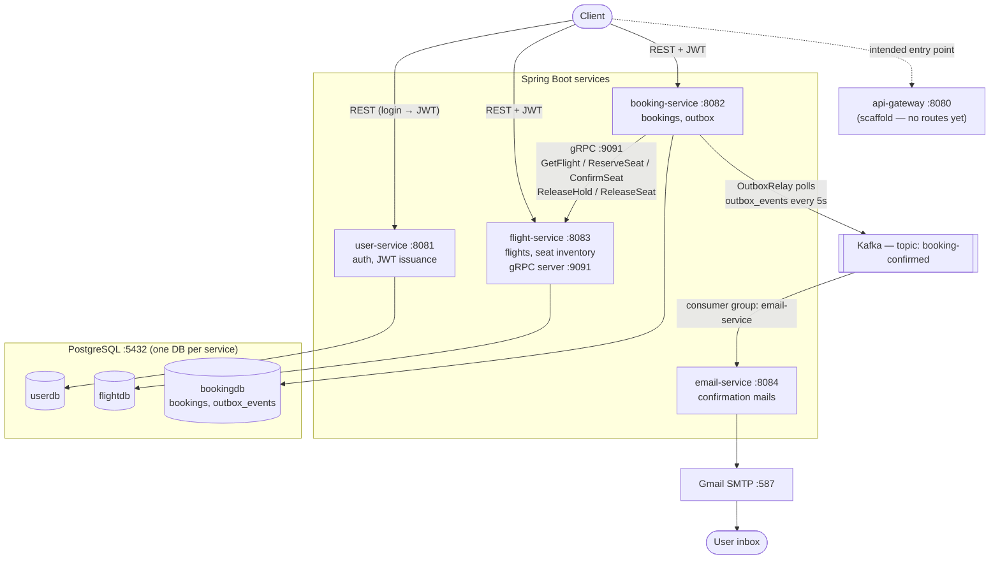
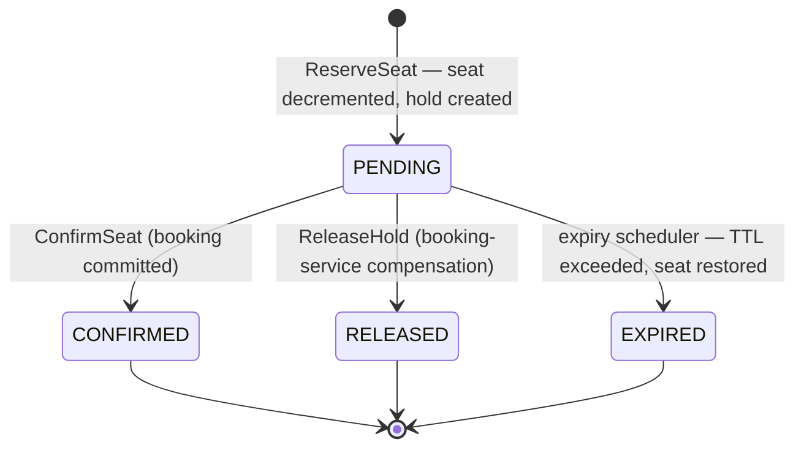
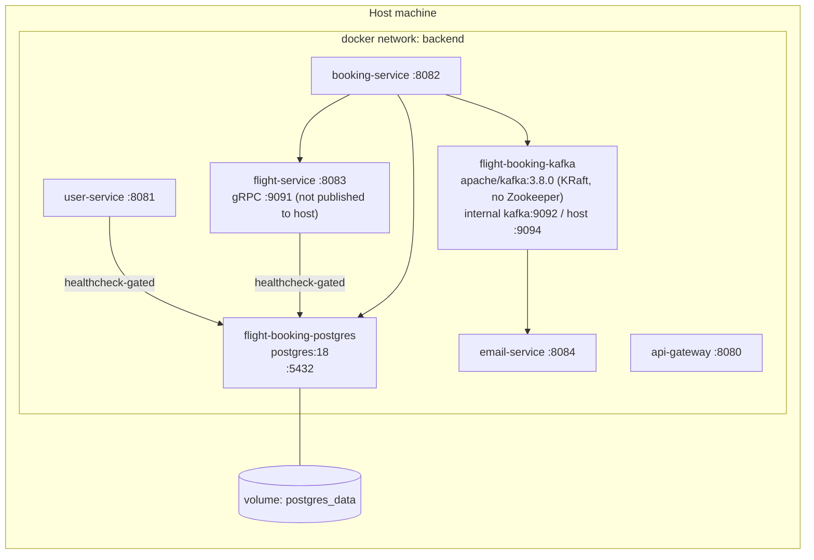

```mermaid
flowchart TB
    Client([Client])
    Proto["shared-proto module<br/>flight_seat.proto:<br/>GetFlight · ReserveSeat · ConfirmSeat<br/>ReleaseHold · ReleaseSeat"]

    subgraph Compose["Docker Compose — network: backend"]
        Gateway["api-gateway :8080<br/>Spring Cloud Gateway scaffold<br/>(routes not yet wired)"]

        subgraph USVC["user-service :8081"]
            AuthAPI["REST<br/>POST /user/add (register)<br/>POST /api/auth/login"]
            JwtIssuer["JwtService<br/>issues HS256 JWT<br/>claims: uid, role (USER / ADMIN)"]
            AuthAPI --> JwtIssuer
        end

        subgraph BSVC["booking-service :8082"]
            BookAPI["REST + JWT filter<br/>POST /bookings/create<br/>PUT /bookings/cancel/:id"]
            BookLogic["BookingServiceImpl (@Transactional)<br/>reserve seat → persist booking → confirm hold<br/>compensating release on failure"]
            GrpcClient["FlightSeatGrpcClient"]
            OutboxWriter["OutboxEventWriter<br/>writes outbox_events row<br/>in SAME transaction as booking"]
            OutboxRelay["OutboxRelay (@Scheduled 5s)<br/>polls PENDING (batch ≤ 50) → publishes<br/>marks SENT via REQUIRES_NEW"]
            BookAPI --> BookLogic
            BookLogic --> GrpcClient
            BookLogic --> OutboxWriter
        end

        subgraph FSVC["flight-service :8083 REST / :9091 gRPC"]
            FlightAPI["REST + JWT filter<br/>/flights CRUD + search<br/>(writes: ADMIN only)"]
            GrpcServer["FlightSeatGrpcService<br/>gRPC server :9091 (plaintext)"]
            SeatInv["Seat inventory per class<br/>ECONOMY / BUSINESS<br/>atomic decrement / increment"]
            HoldSM["SeatHold state machine<br/>PENDING → CONFIRMED<br/>PENDING → RELEASED / EXPIRED"]
            Expiry["SeatHoldExpiryScheduler (@Scheduled 60s)<br/>expires PENDING holds past TTL (10 min)<br/>restores seats to inventory"]
            FlightAPI --> SeatInv
            GrpcServer --> SeatInv
            GrpcServer --> HoldSM
            Expiry --> HoldSM
        end

        subgraph ESVC["email-service :8084 — no DB"]
            Listener["@KafkaListener<br/>topic: booking-confirmed<br/>group: email-service"]
            Mailer["EmailService<br/>JavaMailSender → HTML mail"]
            ApiKey["X-Internal-Api-Key filter<br/>POST /api/emails/booking-confirmation"]
            Listener --> Mailer
            ApiKey --> Mailer
        end

        Kafka[["Kafka (KRaft)<br/>topic: booking-confirmed"]]

        subgraph PG["PostgreSQL :5432 — one database per service, no shared schema"]
            UDB[("userdb<br/>users")]
            FDB[("flightdb<br/>flights · flight_seats · seat_holds")]
            BDB[("bookingdb<br/>bookings · outbox_events")]
        end
    end

    Client -.->|"planned entry point"| Gateway
    Client -->|"1 · register / login → JWT"| AuthAPI
    Client -->|"search flights (JWT)"| FlightAPI
    Client -->|"2 · create booking (JWT)"| BookAPI

    GrpcClient -->|"3 · ReserveSeat → 4 · ConfirmSeat<br/>(GetFlight first; ReleaseHold /<br/>ReleaseSeat on failure or cancel)"| GrpcServer

    Proto -.->|"generated stubs (build-time)"| GrpcClient
    Proto -.->|"generated stubs (build-time)"| GrpcServer

    JwtIssuer -.->|"same JWT_SECRET verified independently<br/>by each service — no central auth call"| BookAPI

    JwtIssuer --> UDB
    SeatInv --> FDB
    HoldSM --> FDB
    BookLogic -->|"5 · booking + outbox row<br/>one atomic commit"| BDB
    OutboxWriter --> BDB
    OutboxRelay -->|"6 · poll PENDING"| BDB
    OutboxRelay -->|"7 · publish JSON, key = bookingId"| Kafka
    Kafka -->|"8 · consume"| Listener
    Mailer -->|"9 · STARTTLS :587"| Gmail["Gmail SMTP"]
    Gmail -->|"10 · confirmation email"| Inbox([User inbox])
```

<h1 align="center">✈️ SkyRoute – Microservices Flight Booking Platform</h1>

  <b>Java | Spring Boot | Spring Cloud gRPC | Kafka | PostgreSQL | Docker</b>

  
  
  
  
  

<h2>🗺️ Architecture</h2>

Full architecture documentation (booking sequence, seat-hold state machine, deployment view): <a href="docs/architecture.md">docs/architecture.md</a>

<h3>🔬 Detailed view — service internals</h3>

<b>Booking-confirmation flow, end to end:</b>

1. Client registers/logs in at <b>user-service</b> and receives an HS256 JWT (claims: <code>uid</code>, <code>role</code>).
2. Client calls <code>POST /bookings/create</code> on <b>booking-service</b>; its JWT filter validates the token locally with the shared secret.
3. <code>BookingServiceImpl</code> calls <b>flight-service</b> over gRPC: <code>GetFlight</code> (flight details), then <code>ReserveSeat</code> — an atomic seat decrement that creates a <code>SeatHold</code> in <code>PENDING</code>.
4. The booking row is persisted, then <code>ConfirmSeat</code> flips the hold <code>PENDING → CONFIRMED</code>. Any failure triggers a compensating <code>ReleaseSeat</code>/<code>ReleaseHold</code> (and abandoned holds are reclaimed by the 60s <code>SeatHoldExpiryScheduler</code> after the 10-minute TTL).
5. In the <b>same database transaction</b> as the booking, <code>OutboxEventWriter</code> inserts a <code>booking-confirmed</code> event into <code>outbox_events</code> (status <code>PENDING</code>) — the booking and its event commit or roll back together.
6. <code>OutboxRelay</code> wakes every 5 seconds and reads pending outbox rows (oldest first, batch ≤ 50).
7. Each event is published to the Kafka topic <code>booking-confirmed</code> (key = bookingId), then marked <code>SENT</code> in a <code>REQUIRES_NEW</code> transaction — a crash between publish and mark means a re-publish, so delivery is at-least-once.
8. <b>email-service</b> (consumer group <code>email-service</code>) receives the event.
9. It renders the HTML confirmation and sends it through Gmail SMTP (<code>smtp.gmail.com:587</code>, STARTTLS).
10. The passenger receives the booking-confirmation email — the booking transaction never waited on Kafka or the mail provider.

<h3>🔁 Seat Hold Lifecycle</h3>

Holds live in flight-service's <code>seat_holds</code> table. <code>SeatHoldExpiryScheduler</code> (every 60s) reclaims seats from holds left <code>PENDING</code> past the TTL (<code>seat.hold.ttl-minutes</code>, default 10 min), so a crashed booking-service can't strand inventory.

<h3>📦 Deployment (docker-compose)</h3>

<ul>
  <li><code>docker/postgres-init/init-databases.sql</code> creates <code>userdb</code>, <code>flightdb</code>, <code>bookingdb</code> and their per-service roles on first boot.</li>
  <li>Kafka exposes two listeners: <code>kafka:9092</code> for containers on the <code>backend</code> network, <code>localhost:9094</code> for services run on the host (IDE/Maven).</li>
  <li>Secrets come from <code>.env</code>: <code>JWT_SECRET</code>, <code>MAIL_USERNAME</code>, <code>MAIL_APP_PASSWORD</code>, <code>EMAIL_SERVICE_API_KEY</code>.</li>
</ul>

<h3>📨 Messaging</h3>

<table>
  <tr><th>Topic</th><th>Producer</th><th>Consumer (group)</th><th>Payload</th><th>Semantics</th></tr>
  <tr><td><code>booking-confirmed</code></td><td>booking-service <code>OutboxRelay</code> (key = bookingId)</td><td>email-service (<code>email-service</code>)</td><td><code>BookingConfirmedEvent</code> JSON</td><td>at-least-once via transactional outbox</td></tr>
  <tr><td><code>booking-confirmed-retry-0/1/2</code></td><td>Spring Kafka retry topic mechanism (auto-created)</td><td>email-service</td><td>same event, re-delivered</td><td>exponential backoff: 1s → 2s → 4s, 4 attempts total</td></tr>
  <tr><td><code>booking-confirmed-dlt</code></td><td>Spring Kafka (after final failed attempt)</td><td><code>@DltHandler</code> in <code>BookingConfirmedEventListener</code></td><td>same event</td><td>terminal — logged, not retried further</td></tr>
</table>

<h3>🔑 Key architectural notes</h3>
<ul>
  <li><b>No service discovery / config server</b> — addresses are static (<code>grpc.client.flight-service.address=static://localhost:9091</code>, Kafka bootstrap hard-coded per profile).</li>
  <li><b>JWT with a shared secret</b>: user-service issues HS256 tokens (<code>sub</code>=email, claims <code>uid</code>, <code>role</code>); flight-service and booking-service each verify independently with the same <code>JWT_SECRET</code>. There is no shared auth library — the JWT filter/service classes are duplicated per service.</li>
  <li><b>gRPC :9091 is plaintext and unauthenticated</b> — booking-service's identity claims are trusted implicitly inside the network.</li>
  <li><b>email-service</b> has no Spring Security; its REST endpoint (<code>POST /api/emails/booking-confirmation</code>) is protected by a static <code>X-Internal-Api-Key</code> header.</li>
</ul>

<h2>🚀 Project Overview</h2>

A backend flight booking system split into independently deployable Spring Boot services, communicating over
<b>REST</b> (client-facing), <b>gRPC</b> (service-to-service seat inventory operations), and
<b>Kafka</b> (asynchronous booking-confirmation events). Each service owns its own PostgreSQL database —
there is no shared schema.

<h2>🧩 Services</h2>

<table>
  <tr><th>Service</th><th>Port</th><th>Owns</th><th>Responsibility</th></tr>
  <tr><td>user-service</td><td>8081</td><td>userdb</td><td>Registration, login, JWT issuance, user/admin roles</td></tr>
  <tr><td>flight-service</td><td>8083 (REST) / 9091 (gRPC)</td><td>flightdb</td><td>Flight CRUD, search/filter, seat inventory, seat holds</td></tr>
  <tr><td>booking-service</td><td>8082</td><td>bookingdb</td><td>Booking creation/cancellation, orchestrates seat hold via gRPC, publishes booking-confirmed events</td></tr>
  <tr><td>email-service</td><td>8084</td><td>—</td><td>Consumes booking-confirmed Kafka events, sends confirmation email via Gmail SMTP</td></tr>
  <tr><td>api-gateway</td><td>8080</td><td>—</td><td>Scaffolded entry point; routing to downstream services not yet configured</td></tr>
</table>

Shared gRPC/protobuf contracts live in the <code>shared-proto</code> module, consumed by both <code>flight-service</code> and <code>booking-service</code>.

<h2>✨ Core Features</h2>

<h3>🔐 Auth (user-service)</h3>
<ul>
  <li>Registration (<code>/user/add</code>) and login (<code>/api/auth/login</code>) issuing a JWT</li>
  <li>Role-based access: <code>USER</code> / <code>ADMIN</code> (JWT carries role, validated by each service independently with a shared secret)</li>
  <li>Admin-only endpoints (flight management, admin creation) enforced via Spring Security</li>
</ul>

<h3>🛫 Flight & Seat Management (flight-service)</h3>
<ul>
  <li>Add/Update/Delete flights (admin-only), search by source/destination, filter/sort by price and time, pagination</li>
  <li>Per-flight seat inventory by class (Economy / Business) with atomic decrement/increment on reserve/release</li>
  <li>
    Seat hold lifecycle exposed over gRPC to booking-service:
    <ul>
      <li><code>PENDING</code> → seat decremented, hold row created</li>
      <li><code>CONFIRMED</code> → booking succeeded</li>
      <li><code>RELEASED</code> → booking-service explicitly released it (failure/cancellation)</li>
      <li><code>EXPIRED</code> → a scheduled job (<code>SeatHoldExpiryScheduler</code>, every 60s) reclaims seats from holds left <code>PENDING</code> past a configurable TTL (default 10 min), so a crashed booking-service can't strand seats permanently</li>
    </ul>
  </li>
</ul>

<h3>📖 Booking Flow (booking-service)</h3>
<ul>
  <li>Create booking → reserve seat over gRPC → persist booking → confirm hold over gRPC, with compensating release/rollback on failure at each step</li>
  <li>Cancel booking → releases the underlying seat</li>
  <li>Transactional outbox: the <code>booking-confirmed</code> event is written to an <code>outbox_events</code> row in the same DB transaction as the booking; a scheduled <code>OutboxRelay</code> (every 5s) publishes pending events to Kafka and marks them <code>SENT</code> — at-least-once delivery, no lost events if Kafka is down at booking time</li>
  <li>Users can only view/cancel their own bookings; admins can view all</li>
</ul>

<h3>📧 Email Notifications (email-service)</h3>
<ul>
  <li>Kafka consumer (<code>groupId=email-service</code>, topic <code>booking-confirmed</code>) triggers a booking confirmation email over Gmail SMTP</li>
  <li>Decoupled from the booking transaction — a slow/down mail provider never blocks a booking</li>
  <li>Templated HTML confirmation built only from the event payload — no synchronous calls back to booking-service or flight-service</li>
  <li><code>@RetryableTopic</code>: up to 4 attempts with exponential backoff (1s → 2s → 4s), each retry routed to its own auto-created topic so a failing message never blocks other messages behind it</li>
  <li>Messages that still fail after all retries land on <code>booking-confirmed-dlt</code> (dead-letter topic) instead of retrying forever or being silently dropped</li>
</ul>

<h3>⚠️ Exception Handling</h3>
<ul>
  <li>Per-service centralized exception handlers, custom exception types, consistent JSON error responses</li>
</ul>

<h2>🧱 Tech Stack</h2>

<ul>
  <li><b>Language:</b> Java 21</li>
  <li><b>Backend:</b> Spring Boot 3.x, Spring Security, Spring Data JPA, Spring Kafka, Spring gRPC (grpc-spring-boot-starter)</li>
  <li><b>Database:</b> PostgreSQL (one database per service)</li>
  <li><b>Messaging:</b> Apache Kafka</li>
  <li><b>Service-to-service:</b> gRPC + Protocol Buffers (shared-proto module)</li>
  <li><b>Auth:</b> JWT</li>
  <li><b>Build:</b> Maven (multi-module)</li>
  <li><b>Infra:</b> Docker Compose (Postgres, Kafka, and all services)</li>
</ul>

<h2>📂 Project Structure</h2>

<pre>
flight-booking-system/
├── user-service/        # registration, login, JWT, roles
├── flight-service/      # flights, seat inventory, seat holds (REST + gRPC server)
├── booking-service/     # bookings, gRPC client, transactional outbox → Kafka
├── email-service/       # Kafka consumer, SMTP sender
├── api-gateway/         # scaffolded, routing not yet wired
├── shared-proto/        # .proto contracts shared by flight-service & booking-service
├── docs/                # architecture diagrams (docs/architecture.md)
├── docker/postgres-init/# creates per-service databases/roles on first boot
└── docker-compose.yml
</pre>

<h2>🔗 Key API Endpoints</h2>

<h3>user-service</h3>
<table>
  <tr><th>Method</th><th>Endpoint</th><th>Auth</th><th>Description</th></tr>
  <tr><td>POST</td><td>/user/add</td><td>Public</td><td>Register a user</td></tr>
  <tr><td>POST</td><td>/api/auth/login</td><td>Public</td><td>Login, returns JWT</td></tr>
  <tr><td>POST</td><td>/api/admin/create-admin</td><td>ADMIN</td><td>Create another admin</td></tr>
  <tr><td>GET</td><td>/user/id/{id}</td><td>Authenticated</td><td>Get user by id</td></tr>
</table>

<h3>flight-service</h3>
<table>
  <tr><th>Method</th><th>Endpoint</th><th>Auth</th><th>Description</th></tr>
  <tr><td>POST</td><td>/flights/add</td><td>ADMIN</td><td>Add flight with seat classes/prices</td></tr>
  <tr><td>GET</td><td>/flights/allFlights</td><td>Authenticated</td><td>Paginated flight list</td></tr>
  <tr><td>GET</td><td>/flights/search?source=&destination=</td><td>Authenticated</td><td>Search flights</td></tr>
  <tr><td>GET</td><td>/flights/filter/price?minPrice=&maxPrice=</td><td>Authenticated</td><td>Filter by price range</td></tr>
  <tr><td>PUT</td><td>/flights/update/{id}</td><td>ADMIN</td><td>Update flight</td></tr>
  <tr><td>DELETE</td><td>/flights/delete/{id}</td><td>ADMIN</td><td>Delete flight</td></tr>
</table>

<h3>booking-service</h3>
<table>
  <tr><th>Method</th><th>Endpoint</th><th>Auth</th><th>Description</th></tr>
  <tr><td>POST</td><td>/bookings/create</td><td>Authenticated</td><td>Reserve a seat and create a booking</td></tr>
  <tr><td>GET</td><td>/bookings/all</td><td>Authenticated</td><td>Own bookings (all bookings if ADMIN)</td></tr>
  <tr><td>GET</td><td>/bookings/get/{id}</td><td>Authenticated</td><td>Get a booking by id (owner or ADMIN)</td></tr>
  <tr><td>PUT</td><td>/bookings/cancel/{id}</td><td>Authenticated</td><td>Cancel a booking and release its seat</td></tr>
</table>

<h2>⚙️ Setup & Run</h2>

<h3>1. Clone & configure secrets</h3>
<pre>
git clone https://github.com/&lt;your-org&gt;/flight-booking-system.git
cd flight-booking-system
</pre>
Create a <code>.env</code> file in the repo root with:
<pre>
JWT_SECRET=&lt;a long random string, shared by all services&gt;
MAIL_USERNAME=&lt;gmail address used for sending confirmations&gt;
MAIL_APP_PASSWORD=&lt;gmail app password&gt;
EMAIL_SERVICE_API_KEY=&lt;api key for email-service's own protected endpoint&gt;
</pre>

<h3>2. Run everything with Docker Compose</h3>
<pre>
docker-compose up --build -d
docker-compose ps
docker-compose logs -f
</pre>
This starts Postgres (with per-service databases/roles auto-created), Kafka, and all four Spring Boot services.

<h3>3. Run a service locally instead (optional)</h3>
Start only the infra in Docker:
<pre>
docker-compose up -d postgres kafka
</pre>
Then run any service from your IDE/Maven with <code>JWT_SECRET</code> (and, for email-service, the mail vars) set as environment variables — each service's <code>application.properties</code> already points at <code>localhost:5432</code> and <code>localhost:9094</code>.

<blockquote>
<b>Note:</b> if you also have a native PostgreSQL install on Windows, it will bind <code>127.0.0.1:5432</code> ahead of Docker's container and silently intercept connections meant for Docker. Stop the local <code>postgresql-x64-*</code> service before running services locally against the Docker database.
</blockquote>

<h3>4. Bootstrapping the first admin</h3>
There's currently no seed admin account. Register a normal user via <code>/user/add</code>, then promote it directly in Postgres:
<pre>
docker exec flight-booking-postgres psql -U user_service_user -d userdb \
  -c "UPDATE users SET role='ADMIN' WHERE email='you@example.com';"
</pre>
Log in again afterward to get a JWT carrying the ADMIN role.

<h2>🎯 Roadmap</h2>
<ul>
  <li>Wire up api-gateway routing so clients don't need to know individual service ports</li>
  <li>Seed a default admin account instead of the manual SQL bootstrap step</li>
  <li>Payment integration</li>
  <li>React frontend</li>
</ul>

<h2>👨‍💻 Author</h2>

<b>Atanu Das</b> Java Backend Developer

<h2>⭐ Support</h2>

If you like this project, give it a ⭐ on GitHub!

