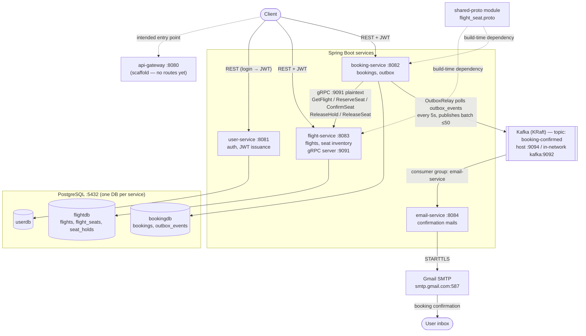
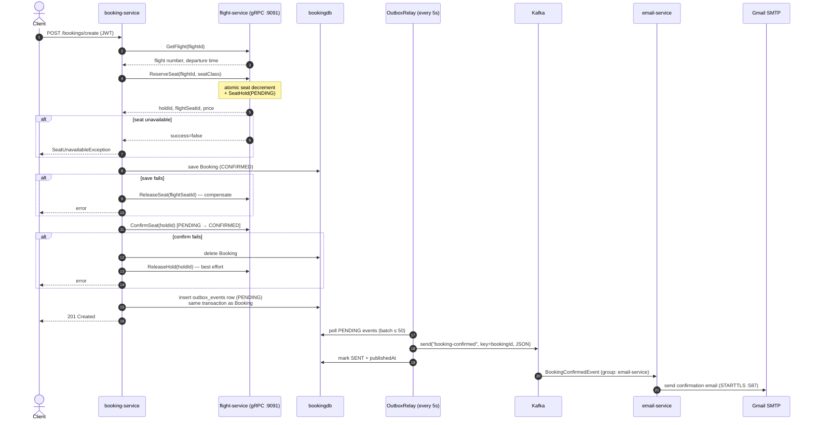
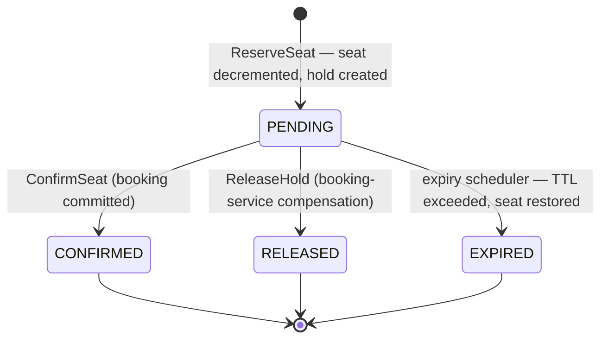
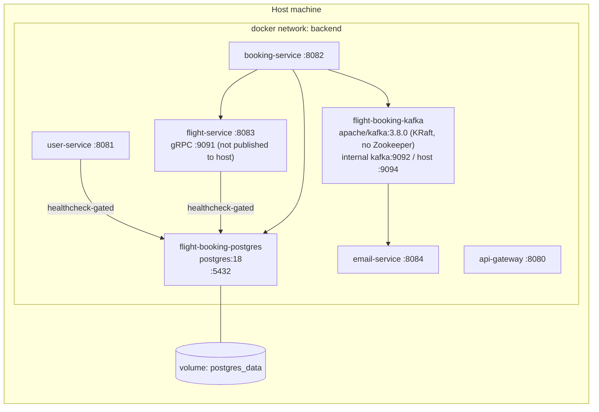

# SkyRoute — Architecture

A Maven multi-module microservices platform: Java 21, Spring Boot 3.5, PostgreSQL (database-per-service), Apache Kafka (KRaft), and gRPC for service-to-service seat inventory operations.

## Services at a glance

| Service | Port(s) | Database | Responsibility |
|---|---|---|---|
| api-gateway | 8080 | — | Spring Cloud Gateway scaffold — **no routes configured yet**; clients call services directly |
| user-service | 8081 | `userdb` | Registration, login, JWT issuance (HS256), USER/ADMIN roles |
| booking-service | 8082 | `bookingdb` | Booking create/cancel, seat-hold orchestration over gRPC, transactional outbox → Kafka |
| flight-service | 8083 (REST), 9091 (gRPC) | `flightdb` | Flight CRUD/search, seat inventory, seat-hold lifecycle, hold-expiry scheduler |
| email-service | 8084 | — | Consumes `booking-confirmed` from Kafka, sends confirmation email via Gmail SMTP |
| shared-proto | — | — | Protobuf/gRPC contracts (`flight_seat.proto`), compile-time dependency of flight-service and booking-service |

## System overview

Key points:

- **No service discovery / config server** — addresses are static (`grpc.client.flight-service.address=static://localhost:9091`, Kafka bootstrap hard-coded per profile).
- **JWT with a shared secret**: user-service issues HS256 tokens (`sub`=email, claims `uid`, `role`); flight-service and booking-service each verify independently with the same `JWT_SECRET`. There is no shared auth library — the JWT filter/service classes are duplicated per service.
- **gRPC :9091 is plaintext and unauthenticated** — booking-service's identity claims are trusted implicitly inside the network.
- **email-service** has no Spring Security; its REST endpoint (`POST /api/emails/booking-confirmation`) is protected by a static `X-Internal-Api-Key` header.

## Booking creation flow (with compensation paths)

`BookingServiceImpl.createBooking` is `@Transactional`; the booking row and its outbox event commit atomically. Kafka publication is decoupled via the **transactional outbox** pattern.

Delivery is **at-least-once**: if the relay crashes between `send` and `markSent`, the event is re-published on the next poll — consumers must tolerate duplicates.

## Seat hold lifecycle

Holds live in flight-service's `seat_holds` table. A scheduler (`SeatHoldExpiryScheduler`, every 60s) reclaims seats from holds left `PENDING` past the TTL (`seat.hold.ttl-minutes`, default 10), so a crashed booking-service cannot strand inventory.

## Deployment (docker-compose)

- `docker/postgres-init/init-databases.sql` creates `userdb`, `flightdb`, `bookingdb` and their per-service roles on first boot.
- Kafka exposes two listeners: `kafka:9092` for containers on the `backend` network, `localhost:9094` for services run on the host (IDE/Maven). Services' `application.properties` default to the host listener.
- Secrets come from `.env`: `JWT_SECRET`, `MAIL_USERNAME`, `MAIL_APP_PASSWORD`, `EMAIL_SERVICE_API_KEY`.

## Messaging

| Topic | Producer | Consumer (group) | Payload | Semantics |
|---|---|---|---|---|
| `booking-confirmed` | booking-service `OutboxRelay` (key = bookingId) | email-service (`email-service`) | `BookingConfirmedEvent` JSON | at-least-once via transactional outbox |
